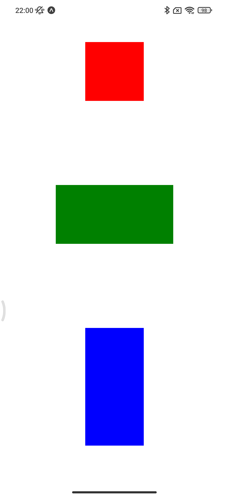
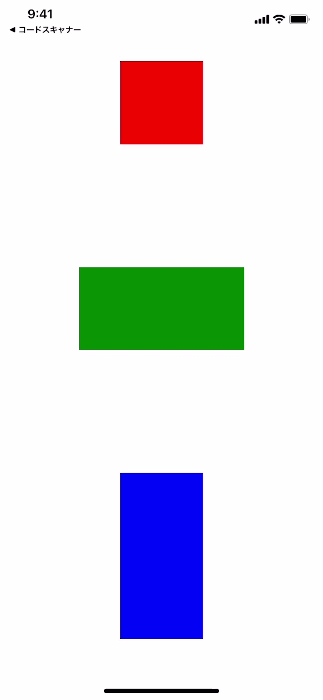

# react-native-simple-responsive-size

**Simple utility library for calclating sizes against each smartphone screen sizes. It helps resizing views with keeping aspect ratio.**

This library is based on the iPhone 12/13 screen size (which can be changed) and is designed to calculate the View size according to the screen size of each device. By determining the base screen size, the aspect ratio can be made the same for all devices.

## Usage

### Add this library and peer dependencies.

NOTE: This library requires [lekzd's react-native-iphone-x-helper](https://github.com/lekzd/react-native-iphone-x-helper.git) because of getting the accurate safe area height.

```sh
yarn add react-native-simple-responsive-size
yarn add react-native-iphone-x-helper@https://github.com/lekzd/react-native-iphone-x-helper.git
```

### Use this library.

```jsx
import { View, StyleSheet } from "react-native";
import { ResponsiveSize } from "react-native-simple-responsive-size";

const Screen = () => {
  return <View style={styles.box} />;
};

const styles = StyleSheet.create({
  box: {
    width: ResponsiveSize(300),
    height: ResponsiveSize(300),
  },
});
```

## References

| Function              | Alias  | Description                                         |
| --------------------- | ------ | --------------------------------------------------- |
| ResponsiveSize        | RSize  | Return raw calclated result.                        |
| ResponsiveRoundedSize | RRSize | Return rounded result.                              |
| ResponsiveTruncedSize | RTSize | Return trunced result.                              |
| changeBaseSize        | -      | Change base size. (Default: iPhone12/13, w390 h844) |

## Examples

### App

This repository contains expo-based example app. For running example app, move to the `example-app` directory, and execute `yarn` and `yarn start`.

### Photos

| Android                                                       | iOS                                                       |
| ------------------------------------------------------------- | --------------------------------------------------------- |
|  |  |
